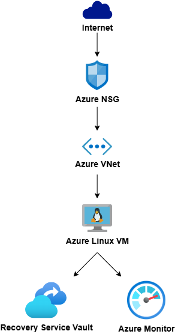

# Azure Administrator Lab (AZ-104)

## Overview
This repository documents a hands-on Azure Administrator lab designed to align with the **AZ-104: Microsoft Azure Administrator** certification objectives.

The project simulates a real-world scenario where a small company requires a **secure, monitored, and cost-optimized Linux server** deployed in Microsoft Azure.

All components were implemented using Azure Portal and Azure CLI with a focus on best practices, least privilege, and operational readiness.
---
## Project Scenario
A small organization requires:
- A secure internal Linux server
- Controlled network access
- Centralized monitoring and alerting
- Automated cost optimization
- Role-based access control

---

## Architecture Summary

### Core Components
- **Resource Group:** `rg-az104-lab`
- **Region:** West US 2
- **Virtual Network:** Custom VNet with dedicated subnet
- **Virtual Machine:** Linux VM (Ubuntu)
- **Public Access:** Disabled by default
- **Access Model:** Private / Controlled
- ## Architecture Diagram

---

## Implemented Domains (AZ-104 Coverage)

###  Identity & Access Management
- Azure Entra ID users and groups
- Group-based RBAC assignments
- Least-privilege access model
- Resource Group–level scope

📄 Details: `security/rbac.md`

---

###  Networking
- Virtual Network and Subnet design
- Subnet-level Network Security Group (NSG)
- Restricted inbound access (no default public exposure)
- Support for private access patterns (Bastion / Jumpbox / VPN)

📄 Details: `security/nsg.md`

---

###  Virtual Machines
- Linux VM deployment
- SSH-based administration
- VM lifecycle management
- Resize, start, stop, and deallocate operations

---

###  Storage
- Azure Storage Account concepts
- Blob and File Share awareness
- Private access considerations
- Storage design aligned with security best practices

---

###  Monitoring & Alerts
- Azure Monitor metrics
- CPU and network performance monitoring
- Metric-based alert creation and validation
- Alert lifecycle management

📄 Details: `operations/monitoring.md`

---

###  Backup & Recovery
- Recovery Services Vault
- VM backup configuration
- Restore awareness and validation
- Data protection as an operational responsibility

 Details: `operations/backup.md`

---

###  Automation & CLI
- Azure CLI authentication and usage
- VM start/stop and deallocate via CLI
- Scheduled automation using Azure Automation
- Cost optimization through deallocation

 Details: `operations/automation.md`

---

## Cost Optimization Strategy
- VM deallocated when not in use
- No public IP attached by default
- Automation schedules reduce compute cost
- Alerts removed when not needed

---

## Security Principles Applied
- Least privilege
- Defense in depth
- No unnecessary public exposure
- Centralized and auditable access control

---

## Validation
- All configurations validated via Azure Portal and Azure CLI
- RBAC tested with assigned users
- NSG rules reviewed and verified
- VM power states confirmed through CLI

---

## Outcome
This project demonstrates the ability to:
- Design and manage Azure infrastructure
- Secure resources using RBAC and NSGs
- Monitor and protect workloads
- Automate operations
- Optimize cloud cost

The environment is **production-ready in design** and fully aligned with **AZ-104 exam objectives**.

---

## Certification Alignment
This lab covers the following AZ-104 skill areas:
- Manage Azure identities and governance
- Implement and manage storage
- Deploy and manage Azure compute resources
- Configure and manage virtual networking
- Monitor and back up Azure resources

---

## Author
**Azure Administrator Lab – AZ-104**  
Hands-on implementation using Azure Portal and Azure CLI
